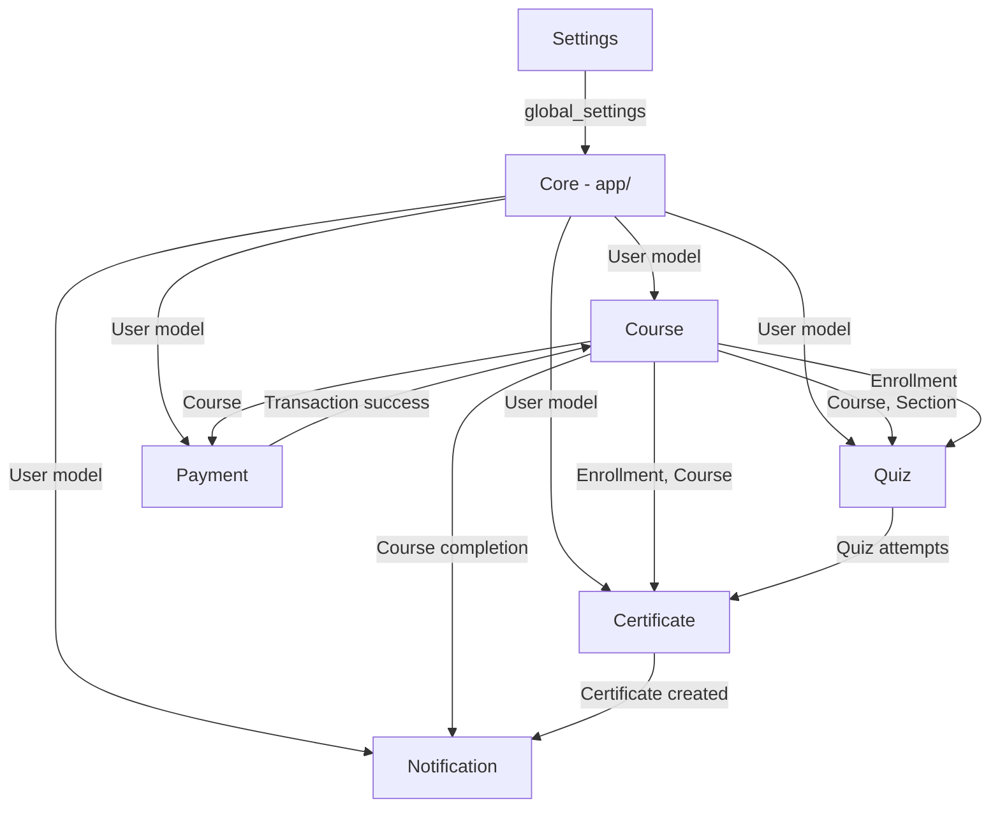

# Modularisasi Fitur Existing LMS-Course (Tanpa Filament)

## Tujuan

Memindahkan seluruh fitur existing dari arsitektur monolitik (`app/`) ke arsitektur modular (`Modules/`) mengikuti pola dari `MODULE_ANATOMY.txt`, tapi **tanpa Filament**. Menggunakan pengganti: **Controllers + Inertia/React Pages + Form Requests**.

---

## Status Saat Ini

Semua code berada di `app/` secara flat:
- **22 Models** di `app/Models/`
- **17 Controllers** di `app/Http/Controllers/`
- **2 Services** di `app/Services/`
- **30+ React Pages** di `resources/js/Pages/`
- **1 migration file** berisi 19 tabel sekaligus
- **Routes** semua di `routes/web.php` (157 baris)

---

## Pembagian Modul

Berdasarkan analisa dependensi antar model dan controller, berikut pembagian modul yang diusulkan:

### Modul 1: `Course` (Core) ← Modul Utama

| Komponen | File Source | File Target |
|---|---|---|
| **Models** | | |
| Course.php | `app/Models/Course.php` | `Modules/Course/Models/Course.php` |
| Section.php | `app/Models/Section.php` | `Modules/Course/Models/Section.php` |
| Lesson.php | `app/Models/Lesson.php` | `Modules/Course/Models/Lesson.php` |
| CoursePhoto.php | `app/Models/CoursePhoto.php` | `Modules/Course/Models/CoursePhoto.php` |
| Category.php | `app/Models/Category.php` | `Modules/Course/Models/Category.php` |
| LessonProgress.php | `app/Models/LessonProgress.php` | `Modules/Course/Models/LessonProgress.php` |
| **Controllers** | | |
| CourseBuilderController | `app/Http/Controllers/Mentor/CourseBuilderController.php` | `Modules/Course/Http/Controllers/Mentor/CourseBuilderController.php` |
| CatalogController | `app/Http/Controllers/CatalogController.php` | `Modules/Course/Http/Controllers/CatalogController.php` |
| CategoryController | `app/Http/Controllers/Admin/CategoryController.php` | `Modules/Course/Http/Controllers/Admin/CategoryController.php` |
| CourseManagementController | `app/Http/Controllers/Admin/CourseManagementController.php` | `Modules/Course/Http/Controllers/Admin/CourseManagementController.php` |
| StudentCourseController | `app/Http/Controllers/Student/CourseController.php` | `Modules/Course/Http/Controllers/Student/CourseController.php` |
| **Services** | | |
| CourseCompletionService | `app/Services/CourseCompletionService.php` | `Modules/Course/Services/CourseCompletionService.php` |
| **React Pages** | | |
| Catalog.jsx | `resources/js/Pages/Catalog.jsx` | `Modules/Course/resources/js/Pages/Catalog.jsx` |
| CourseDetail.jsx | `resources/js/Pages/CourseDetail.jsx` | `Modules/Course/resources/js/Pages/CourseDetail.jsx` |
| Learn.jsx | `resources/js/Pages/Learn.jsx` | `Modules/Course/resources/js/Pages/Learn.jsx` |
| Dashboard/MyCourses.jsx | `resources/js/Pages/Dashboard/MyCourses.jsx` | `Modules/Course/resources/js/Pages/Dashboard/MyCourses.jsx` |
| Dashboard/Catalog.jsx | `resources/js/Pages/Dashboard/Catalog.jsx` | `Modules/Course/resources/js/Pages/Dashboard/Catalog.jsx` |
| Mentor/CourseBuilder/* | `resources/js/Pages/Mentor/CourseBuilder/*.jsx` | `Modules/Course/resources/js/Pages/Mentor/CourseBuilder/*.jsx` |
| Mentor/Courses.jsx | `resources/js/Pages/Mentor/Courses.jsx` | `Modules/Course/resources/js/Pages/Mentor/Courses.jsx` |
| Mentor/Students.jsx | `resources/js/Pages/Mentor/Students.jsx` | `Modules/Course/resources/js/Pages/Mentor/Students.jsx` |
| Admin/Courses.jsx | `resources/js/Pages/Admin/Courses.jsx` | `Modules/Course/resources/js/Pages/Admin/Courses.jsx` |
| Admin/Categories.jsx | `resources/js/Pages/Admin/Categories.jsx` | `Modules/Course/resources/js/Pages/Admin/Categories.jsx` |
| CatalogContent Component | `resources/js/Components/CatalogContent.jsx` | `Modules/Course/resources/js/Components/CatalogContent.jsx` |
| **Migration** | Split dari `2026_03_05_090720_create_lms_tables.php` | `Modules/Course/Database/Migrations/` |

---

### Modul 2: `Quiz`

| Komponen | File Source | File Target |
|---|---|---|
| **Models** | | |
| Quiz.php | `app/Models/Quiz.php` | `Modules/Quiz/Models/Quiz.php` |
| QuizQuestion.php | `app/Models/QuizQuestion.php` | `Modules/Quiz/Models/QuizQuestion.php` |
| QuizOption.php | `app/Models/QuizOption.php` | `Modules/Quiz/Models/QuizOption.php` |
| QuizAttempt.php | `app/Models/QuizAttempt.php` | `Modules/Quiz/Models/QuizAttempt.php` |
| QuizAnswer.php | `app/Models/QuizAnswer.php` | `Modules/Quiz/Models/QuizAnswer.php` |
| Submission.php | `app/Models/Submission.php` | `Modules/Quiz/Models/Submission.php` |
| **Controllers** | | |
| SubmissionController | `app/Http/Controllers/Mentor/SubmissionController.php` | `Modules/Quiz/Http/Controllers/Mentor/SubmissionController.php` |
| *(Quiz logic in CourseBuilder)* | Part of CourseBuilderController | Tetap di Course module, referensi Quiz model via namespace |
| **React Pages** | | |
| QuizPlayer.jsx | `resources/js/Pages/QuizPlayer.jsx` | `Modules/Quiz/resources/js/Pages/QuizPlayer.jsx` |
| QuizPlayerInline.jsx | `resources/js/Components/QuizPlayerInline.jsx` | `Modules/Quiz/resources/js/Components/QuizPlayerInline.jsx` |
| Mentor/CourseBuilder/QuizEditor.jsx | `resources/js/Pages/Mentor/CourseBuilder/QuizEditor.jsx` | `Modules/Quiz/resources/js/Pages/Mentor/QuizEditor.jsx` |
| Mentor/Submissions.jsx | `resources/js/Pages/Mentor/Submissions.jsx` | `Modules/Quiz/resources/js/Pages/Mentor/Submissions.jsx` |

---

### Modul 3: `Payment`

| Komponen | File Source | File Target |
|---|---|---|
| **Models** | | |
| Transaction.php | `app/Models/Transaction.php` | `Modules/Payment/Models/Transaction.php` |
| MentorEarning.php | `app/Models/MentorEarning.php` | `Modules/Payment/Models/MentorEarning.php` |
| MentorWithdrawal.php | `app/Models/MentorWithdrawal.php` | `Modules/Payment/Models/MentorWithdrawal.php` |
| **Controllers** | | |
| PaymentController | `app/Http/Controllers/Payment/PaymentController.php` | `Modules/Payment/Http/Controllers/PaymentController.php` |
| TransactionController | `app/Http/Controllers/Admin/TransactionController.php` | `Modules/Payment/Http/Controllers/Admin/TransactionController.php` |
| EarningController | `app/Http/Controllers/Mentor/EarningController.php` | `Modules/Payment/Http/Controllers/Mentor/EarningController.php` |
| WithdrawalController (Mentor) | `app/Http/Controllers/Mentor/WithdrawalController.php` | `Modules/Payment/Http/Controllers/Mentor/WithdrawalController.php` |
| WithdrawalController (Admin) | `app/Http/Controllers/Admin/WithdrawalController.php` | `Modules/Payment/Http/Controllers/Admin/WithdrawalController.php` |
| **Config** | | |
| midtrans.php | `config/midtrans.php` | `Modules/Payment/Config/midtrans.php` |
| **React Pages** | | |
| Payment/Checkout.jsx | `resources/js/Pages/Payment/Checkout.jsx` | `Modules/Payment/resources/js/Pages/Checkout.jsx` |
| Admin/Transactions.jsx | `resources/js/Pages/Admin/Transactions.jsx` | `Modules/Payment/resources/js/Pages/Admin/Transactions.jsx` |
| Admin/Withdrawals.jsx | `resources/js/Pages/Admin/Withdrawals.jsx` | `Modules/Payment/resources/js/Pages/Admin/Withdrawals.jsx` |
| Mentor/Earnings.jsx | `resources/js/Pages/Mentor/Earnings.jsx` | `Modules/Payment/resources/js/Pages/Mentor/Earnings.jsx` |
| Mentor/Withdrawals.jsx | `resources/js/Pages/Mentor/Withdrawals.jsx` | `Modules/Payment/resources/js/Pages/Mentor/Withdrawals.jsx` |

---

### Modul 4: `Certificate`

| Komponen | File Source | File Target |
|---|---|---|
| **Models** | | |
| Certificate.php | `app/Models/Certificate.php` | `Modules/Certificate/Models/Certificate.php` |
| CertificateTemplate.php | `app/Models/CertificateTemplate.php` | `Modules/Certificate/Models/CertificateTemplate.php` |
| **Controllers** | | |
| CertificateController | `app/Http/Controllers/Student/CertificateController.php` | `Modules/Certificate/Http/Controllers/Student/CertificateController.php` |
| CertificateTemplateController | `app/Http/Controllers/Admin/CertificateTemplateController.php` | `Modules/Certificate/Http/Controllers/Admin/CertificateTemplateController.php` |
| **Services** | | |
| CertificateService | `app/Services/CertificateService.php` | `Modules/Certificate/Services/CertificateService.php` |
| **Views** | | |
| pdf/certificate.blade.php | `resources/views/pdf/certificate.blade.php` | `Modules/Certificate/resources/views/pdf/certificate.blade.php` |
| **React Pages** | | |
| Dashboard/Certificates.jsx | `resources/js/Pages/Dashboard/Certificates.jsx` | `Modules/Certificate/resources/js/Pages/Dashboard/Certificates.jsx` |
| Admin/CertificateTemplates.jsx | `resources/js/Pages/Admin/CertificateTemplates.jsx` | `Modules/Certificate/resources/js/Pages/Admin/CertificateTemplates.jsx` |
| Admin/CertificateDesigner.jsx | `resources/js/Pages/Admin/CertificateDesigner.jsx` | `Modules/Certificate/resources/js/Pages/Admin/CertificateDesigner.jsx` |
| Student/CourseComplete.jsx | `resources/js/Pages/Student/CourseComplete.jsx` | `Modules/Certificate/resources/js/Pages/Student/CourseComplete.jsx` |

---

### Modul 5: `Notification`

| Komponen | File Source | File Target |
|---|---|---|
| **Models** | | |
| Notification.php | `app/Models/Notification.php` | `Modules/Notification/Models/Notification.php` |
| **React Pages** | | |
| Dashboard/ActivityLog.jsx | `resources/js/Pages/Dashboard/ActivityLog.jsx` | `Modules/Notification/resources/js/Pages/Dashboard/ActivityLog.jsx` |

---

### Modul 6: `Settings`

| Komponen | File Source | File Target |
|---|---|---|
| **Models** | | |
| Setting.php | `app/Models/Setting.php` | `Modules/Settings/Models/Setting.php` |
| SiteSetting.php | `app/Models/SiteSetting.php` | `Modules/Settings/Models/SiteSetting.php` |
| **Controllers** | | |
| SettingController | `app/Http/Controllers/Admin/SettingController.php` | `Modules/Settings/Http/Controllers/Admin/SettingController.php` |
| **React Pages** | | |
| Admin/Settings/Index.jsx | `resources/js/Pages/Admin/Settings/Index.jsx` | `Modules/Settings/resources/js/Pages/Admin/Settings/Index.jsx` |

---

### Tetap di `app/` (Core Laravel)

File-file ini tetap di `app/` karena bersifat global/framework-level:

| File | Alasan |
|---|---|
| `app/Models/User.php` | Core auth model, depended by semua modul |
| `app/Http/Controllers/DashboardController.php` | Aggregator multi-modul |
| `app/Http/Controllers/ProfileController.php` | Core auth feature |
| `app/Http/Controllers/Auth/*` | Laravel Breeze auth |
| `app/Http/Controllers/Admin/AnalyticsController.php` | Aggregator multi-modul |
| `app/Http/Controllers/Admin/UserManagementController.php` | Core user management |
| `app/Http/Controllers/Admin/RoleController.php` | Spatie permission management |
| `app/Http/Middleware/*` | Global middleware |
| `app/Http/Requests/Auth/*` | Auth validation |
| `app/Providers/AppServiceProvider.php` | Core bootstrapper |
| `resources/js/Layouts/*` | Shared layouts |
| `resources/js/Components/` (generic) | Shared UI components |
| `resources/js/Context/*` | Global React context |
| `resources/js/Pages/Home.jsx` | Landing page |
| `resources/js/Pages/Welcome.jsx` | Welcome page |
| `resources/js/Pages/Dashboard.jsx` | Dashboard aggregator |
| `resources/js/Pages/Dashboard/Achievements.jsx` | Cross-module |
| `resources/js/Pages/Admin/Analytics.jsx` | Cross-module aggregator |
| `resources/js/Pages/Admin/Users.jsx` | Core user management |
| `resources/js/Pages/Admin/Roles.jsx` | Core permission management |

---

## Struktur Folder Target per Modul

```
Modules/
├── Course/
│   ├── CourseServiceProvider.php
│   ├── Database/
│   │   └── Migrations/
│   │       └── 2026_03_05_000001_create_course_tables.php
│   ├── Models/
│   │   ├── Course.php
│   │   ├── Section.php
│   │   ├── Lesson.php
│   │   ├── CoursePhoto.php
│   │   ├── Category.php
│   │   └── LessonProgress.php
│   ├── Http/
│   │   └── Controllers/
│   │       ├── CatalogController.php
│   │       ├── Admin/
│   │       │   ├── CategoryController.php
│   │       │   └── CourseManagementController.php
│   │       ├── Mentor/
│   │       │   ├── CourseBuilderController.php
│   │       │   └── StudentController.php
│   │       └── Student/
│   │           └── CourseController.php
│   ├── Services/
│   │   └── CourseCompletionService.php
│   ├── Routes/
│   │   └── web.php
│   └── resources/
│       └── js/
│           ├── Pages/
│           │   ├── Catalog.jsx
│           │   ├── CourseDetail.jsx
│           │   ├── Learn.jsx
│           │   ├── Admin/
│           │   │   ├── Courses.jsx
│           │   │   └── Categories.jsx
│           │   ├── Mentor/
│           │   │   ├── Courses.jsx
│           │   │   ├── Students.jsx
│           │   │   └── CourseBuilder/
│           │   │       ├── Index.jsx
│           │   │       ├── Create.jsx
│           │   │       ├── Edit.jsx
│           │   │       └── LessonEditor.jsx
│           │   └── Dashboard/
│           │       ├── MyCourses.jsx
│           │       └── Catalog.jsx
│           └── Components/
│               └── CatalogContent.jsx
│
├── Quiz/
│   ├── QuizServiceProvider.php
│   ├── Database/
│   │   └── Migrations/
│   │       └── 2026_03_05_000002_create_quiz_tables.php
│   ├── Models/
│   │   ├── Quiz.php
│   │   ├── QuizQuestion.php
│   │   ├── QuizOption.php
│   │   ├── QuizAttempt.php
│   │   ├── QuizAnswer.php
│   │   └── Submission.php
│   ├── Http/
│   │   └── Controllers/
│   │       └── Mentor/
│   │           └── SubmissionController.php
│   ├── Routes/
│   │   └── web.php
│   └── resources/
│       └── js/
│           ├── Pages/
│           │   ├── QuizPlayer.jsx
│           │   └── Mentor/
│           │       ├── QuizEditor.jsx
│           │       └── Submissions.jsx
│           └── Components/
│               └── QuizPlayerInline.jsx
│
├── Payment/
│   ├── PaymentServiceProvider.php
│   ├── Config/
│   │   └── midtrans.php
│   ├── Database/
│   │   └── Migrations/
│   │       └── 2026_03_05_000003_create_payment_tables.php
│   ├── Models/
│   │   ├── Transaction.php
│   │   ├── MentorEarning.php
│   │   └── MentorWithdrawal.php
│   ├── Http/
│   │   └── Controllers/
│   │       ├── PaymentController.php
│   │       ├── Admin/
│   │       │   ├── TransactionController.php
│   │       │   └── WithdrawalController.php
│   │       └── Mentor/
│   │           ├── EarningController.php
│   │           └── WithdrawalController.php
│   ├── Routes/
│   │   └── web.php
│   └── resources/
│       └── js/
│           └── Pages/
│               ├── Checkout.jsx
│               ├── Admin/
│               │   ├── Transactions.jsx
│               │   └── Withdrawals.jsx
│               └── Mentor/
│                   ├── Earnings.jsx
│                   └── Withdrawals.jsx
│
├── Certificate/
│   ├── CertificateServiceProvider.php
│   ├── Database/
│   │   └── Migrations/
│   │       └── 2026_03_05_000004_create_certificate_tables.php
│   ├── Models/
│   │   ├── Certificate.php
│   │   └── CertificateTemplate.php
│   ├── Http/
│   │   └── Controllers/
│   │       ├── Student/
│   │       │   └── CertificateController.php
│   │       └── Admin/
│   │           └── CertificateTemplateController.php
│   ├── Services/
│   │   └── CertificateService.php
│   ├── Routes/
│   │   └── web.php
│   └── resources/
│       ├── views/
│       │   └── pdf/
│       │       └── certificate.blade.php
│       └── js/
│           └── Pages/
│               ├── Dashboard/
│               │   └── Certificates.jsx
│               ├── Student/
│               │   └── CourseComplete.jsx
│               └── Admin/
│                   ├── CertificateTemplates.jsx
│                   └── CertificateDesigner.jsx
│
├── Notification/
│   ├── NotificationServiceProvider.php
│   ├── Database/
│   │   └── Migrations/
│   │       └── 2026_03_05_000005_create_notifications_table.php
│   ├── Models/
│   │   └── Notification.php
│   ├── Routes/
│   │   └── web.php
│   └── resources/
│       └── js/
│           └── Pages/
│               └── Dashboard/
│                   └── ActivityLog.jsx
│
└── Settings/
    ├── SettingsServiceProvider.php
    ├── Database/
    │   └── Migrations/
    │       └── 2026_03_05_000006_create_settings_tables.php
    ├── Models/
    │   ├── Setting.php
    │   └── SiteSetting.php
    ├── Http/
    │   └── Controllers/
    │       └── Admin/
    │           └── SettingController.php
    ├── Routes/
    │   └── web.php
    └── resources/
        └── js/
            └── Pages/
                └── Admin/
                    └── Settings/
                        └── Index.jsx
```

---

## Perubahan Infrastruktur yang Diperlukan

### 1. `composer.json` — PSR-4 Autoload

```json
"autoload": {
    "psr-4": {
        "App\\": "app/",
        "Modules\\": "Modules/",
        "Database\\Factories\\": "database/factories/",
        "Database\\Seeders\\": "database/seeders/"
    }
}
```

### 2. `bootstrap/providers.php` — Register Module Providers

```php
return [
    App\Providers\AppServiceProvider::class,
    Modules\Course\CourseServiceProvider::class,
    Modules\Quiz\QuizServiceProvider::class,
    Modules\Payment\PaymentServiceProvider::class,
    Modules\Certificate\CertificateServiceProvider::class,
    Modules\Notification\NotificationServiceProvider::class,
    Modules\Settings\SettingsServiceProvider::class,
];
```

### 3. `resources/js/app.jsx` — Inertia Page Resolution

```jsx
resolve: (name) => {
    // Try module pages first, then fallback to app pages
    const modulePages = import.meta.glob('../../Modules/*/resources/js/Pages/**/*.jsx');
    const appPages = import.meta.glob('./Pages/**/*.jsx');
    const allPages = { ...modulePages, ...appPages };
    
    // Normalize the name to find matching page
    return resolvePageComponent(`./Pages/${name}.jsx`, allPages);
}
```

> [!WARNING]
> Alternatif yang lebih simple: Semua React Pages **tetap di** `resources/js/Pages/` (tidak dipindah ke Modules). Hanya backend (Models, Controllers, Services, Routes, Migrations) yang di-modularisasi. Ini menghindari kompleksitas konfigurasi Vite/Inertia.

### 4. `routes/web.php` — Dikosongkan, tiap modul punya routes sendiri

Routes utama hanya menyisakan:
- Landing page (`/`)
- Dashboard aggregator
- Auth routes
- Profile routes
- Admin analytics, users, roles

### 5. Namespace Update pada semua Model Relations

Karena model pindah namespace (misal `App\Models\Course` → `Modules\Course\Models\Course`), semua relasi yang reference cross-module harus pakai full namespace:

```php
// Di Modules\Quiz\Models\Quiz.php
public function course(): BelongsTo
{
    return $this->belongsTo(\Modules\Course\Models\Course::class);
}
```

---

## User Review Required

> [!IMPORTANT]
> **Keputusan yang diperlukan:**
>
> 1. **React Pages ikut pindah ke Modules atau tetap di `resources/js/Pages/`?**
>    - **Opsi A**: Semua ikut pindah (full modular, tapi perlu konfigurasi Vite/Inertia)
>    - **Opsi B**: React Pages tetap di `resources/js/Pages/`, hanya backend yang dipindah (lebih simple, lebih aman)
>    - **Rekomendasi**: Opsi B lebih aman dan umum digunakan
>
> 2. **Migration approach:**
>    - **Opsi A**: Buat migration baru per modul (database sudah ada, jadi migration baru hanya sebagai dokumentasi — tidak dijalankan ulang)
>    - **Opsi B**: Split migration file yang ada ke masing-masing modul
>    - **Rekomendasi**: Opsi A — biarkan migration lama tetap ada, buat migration baru di modul sebagai referensi
>
> 3. **Mau langsung eksekusi semua modul sekaligus atau satu per satu?**
>    - **Rekomendasi**: Satu per satu mulai dari modul `Course` (paling besar tapi paling independen)

## Verification Plan

### Automated Tests
```bash
composer dump-autoload
php artisan route:list          # Pastikan semua routes tetap terdaftar
php artisan serve               # Cek tidak ada error 500
npm run dev                     # Cek Vite build berhasil
```

### Manual Verification
- Buka setiap halaman admin, mentor, student
- Test CRUD course, quiz, enrollment
- Test payment flow
- Pastikan tidak ada broken pages

---

## Dependency Map (Cross-Module References)



> [!CAUTION]
> Modul **Quiz** sangat tightly-coupled dengan **Course** (Quiz belongs to Course & Section, QuizAttempt belongs to Enrollment). Jika ini dirasa terlalu rumit, Quiz bisa digabung ke dalam modul Course.
